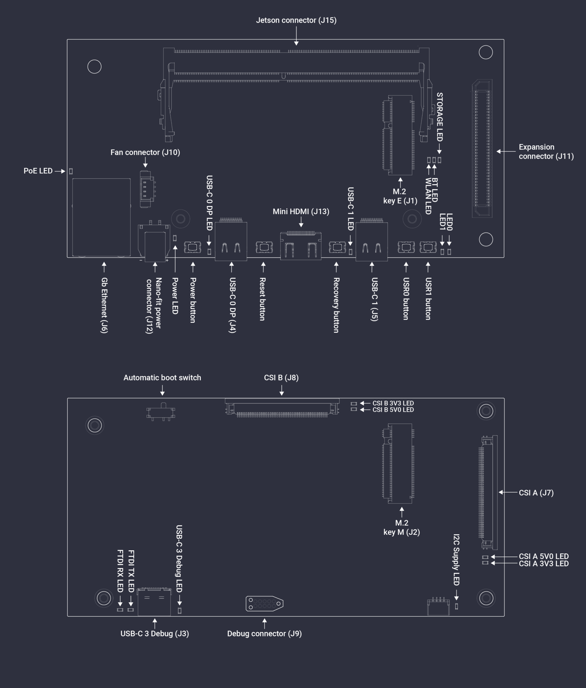

# Board overview

Jetson Orin Baseboard is an open hardware board design supporting NVIDIA Jetson Orin NX and Orin Nano family of SoMs.
The board design files were created in KiCad 7x.
The board is a versatile development kit which can be easily adopted in order to make it usable in commercial applications for autonomous vehicles, industry, agriculture, medicine or space.
You can find out more about the Jetson Orin Baseboard in this [blog article](https://antmicro.com/blog/2023/05/jetson-orin-baseboard-1-1-with-orin-nano/), or by visiting Antmicro's portals listed below:

* [Open Hardware Portal](https://openhardware.antmicro.com/boards/jetson-orin-baseboard/)
* [System Designer](https://designer.antmicro.com/hardware/devices/jetson-orin-baseboard)
* [Open Source Portal](https://opensource.antmicro.com/projects/jetson-orin-baseboard/)
 
They provide 3D renders and the board [stackup definition](https://openhardware.antmicro.com/boards/jetson-orin-baseboard/?view=top-ortho&tab=stackup), as well as [an interactive preview](https://openhardware.antmicro.com/boards/jetson-orin-baseboard/?view=top-ortho&tab=preview) of the board schematic.
A [PDF schematic](./jetson-orin-baseboard-schematic.pdf) of the board is also available.

## IO map 

A map of on-board connectors, status LEDs, control buttons and I/O interfaces is provided below.

:::{figure-md}

Jetson Orin Baseboard interface map
:::

## Power Supply

The board can be powered with the following sources:

### 1. DC Connector
 
Jetson Orin Baseboard can be powered with a stable DC voltage via the on-board locking DC connector (`J12`) with Molex Nano-Fit plug (see the [Power Supply](getting_started.md#power-supply) section for details related to Nano-Fit power harness assembly).
You can use an external DC adapter for powering the board or a battery pack with chargeable or non-rechargeable batteries, as long as the provided voltage fits within the accepted range (9-15VDC).
Please note that Jetson Orin Baseboard does not support battery recharging.

### 2. Power over Ethernet

Jetson Orin Baseboard supports PoE++ Type 3 (IEEE 802.3bt) and negotiates Power Delivery (PD) Class 5 with a maximum power budget of 40W.
The board includes an isolated PoE DC/DC converter.
You can power the board via the Gigabit Ethernet port (`J6`) using a PoE injector or a PoE-capable Ethernet switch.

### 3. USB Power Delivery
    
* USB Power Delivery PD, available on two USB-C ports:
    * USB-C0 (`J4`) general purpose USB port 
    * USB-C3 (`J3`) debug console interface port

Those ports are maintained by the on-board USB Power Delivery controller (Texas Instruments/[TPS65988](https://www.ti.com/product/TPS65988/part-details/TPS65988DHRSHR)).
This controller needs to be configured in order to make it implement one of the desired power source/sink negotiation scenarios.
Please refer to the [TPS65987DDH and TPS65988DH Host Interface Technical Reference Manual](https://www.ti.com/lit/ug/slvubh2b/slvubh2b.pdf) for details.
The configuration of the PD controller is possible via an external flash programmer connected to the debug connector (`J6`) or from the Jetson SoM via the I2C bus. 
If you plan to power up the Jetson Orin Baseboard through the USB PD source, make sure it provides at least 30W of power for basic operation.

## Mechanics

The Jetson Orin Baseboard PCB is 120x60 millimeters (WxL) which translates into 4.72x2.36 inch.
The overall height of the set depends on the cooling module attached.
The base setup with a default cooling module is 37 mm or 1.45 inch tall. 
The KiCad PCB design files include mechanical layers with dimensions specified for the fastening holes and notable components. 
The board with the Jetson Module, M.2 storage and cooling module weighs 164g (5.78oz). 

